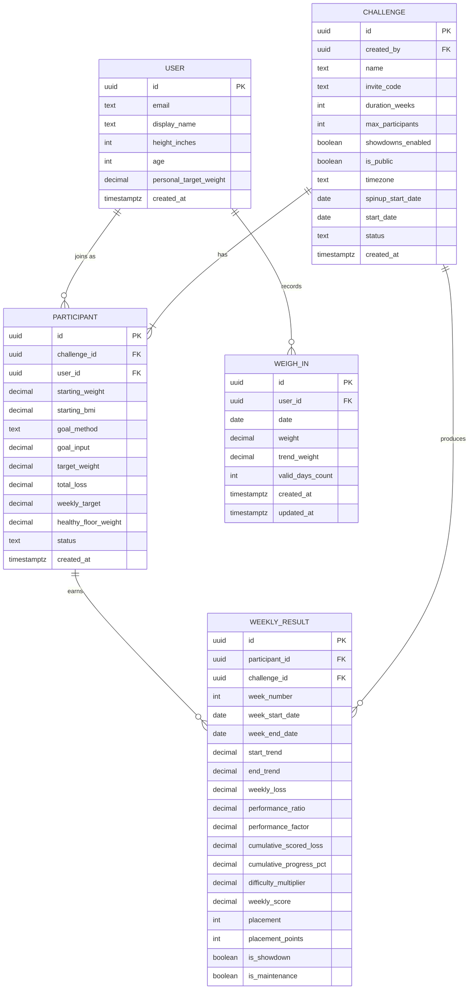

# Data Model

## Entity Relationship Diagram



## Design Principle: Weigh-Ins Belong to Users, Not Challenges

Weigh-ins are recorded at the User level, not the Participant level. This means:

- **Solo tracking works without a challenge.** Any user can log daily weights
  and view their trend without joining a challenge.
- **Challenge scoring reads from user weigh-ins.** When a user is in a
  challenge, the scoring system queries their weigh-ins within the challenge
  date range.
- **Data persists across challenges.** A user's weight history is continuous
  regardless of challenge participation.

## Entity Index

| Entity         | Spec File                                          | Description                          |
|----------------|----------------------------------------------------|--------------------------------------|
| User           | [ENT-USER](entities/ENT-USER.md)                   | Authenticated user account           |
| Challenge      | [ENT-CHALLENGE](entities/ENT-CHALLENGE.md)         | A weight loss challenge instance     |
| Participant    | [ENT-PARTICIPANT](entities/ENT-PARTICIPANT.md)     | A user enrolled in a challenge       |
| Weigh-In       | [ENT-WEIGH-IN](entities/ENT-WEIGH-IN.md)           | A single daily weight recording      |
| Weekly Result  | [ENT-WEEKLY-RESULT](entities/ENT-WEEKLY-RESULT.md) | Computed weekly score and placement  |

## Key Relationships

- A **User** can participate in multiple challenges (one at a time in v1)
- A **Challenge** has exactly 4 participants
- A **Participant** records one **Weigh-In** per day
- **Weekly Results** are computed every Friday from weigh-in trend data
- **Weekly Results** reference both the participant and the challenge for efficient querying

## Status Enums

### Challenge Status
| Value      | Description                                      |
|------------|--------------------------------------------------|
| `setup`    | Created, participants joining and setting goals  |
| `spinup`   | Spin-up week in progress (7 days baseline)       |
| `active`   | Challenge underway, weekly scoring active        |
| `complete` | Challenge ended, winner determined               |

### Participant Status
| Value         | Description                                    |
|---------------|------------------------------------------------|
| `onboarding`  | Joined but hasn't completed goal setup         |
| `spinup`      | In spin-up week, recording baseline weights    |
| `active`      | Challenge active, recording and being scored   |
| `maintenance` | Hit goal early, in ±2 lb maintenance band      |
| `complete`    | Challenge ended                                |

## Scoring Formulas (Reference)

These are implemented in edge functions, documented here for reference:

```
weekly_loss          = start_trend - end_trend
performance_ratio    = weekly_loss / weekly_target
performance_factor   = ratio <= 1.0 ? ratio : max(0, 1 - 2 * (ratio - 1))
cumulative_scored_loss = sum of (weekly_target * performance_factor) from prior weeks
cumulative_progress  = cumulative_scored_loss / total_loss * 100
difficulty_multiplier = min(2.0, 1 + (cumulative_progress / 100))
weekly_score         = weekly_target * performance_factor * difficulty_multiplier
```

## Trend Weight Computation

```
trend_weight = average of last 7 daily weights (minimum 5 of 7 required)
if valid_days_count < 5: trend freezes at last valid value
```
