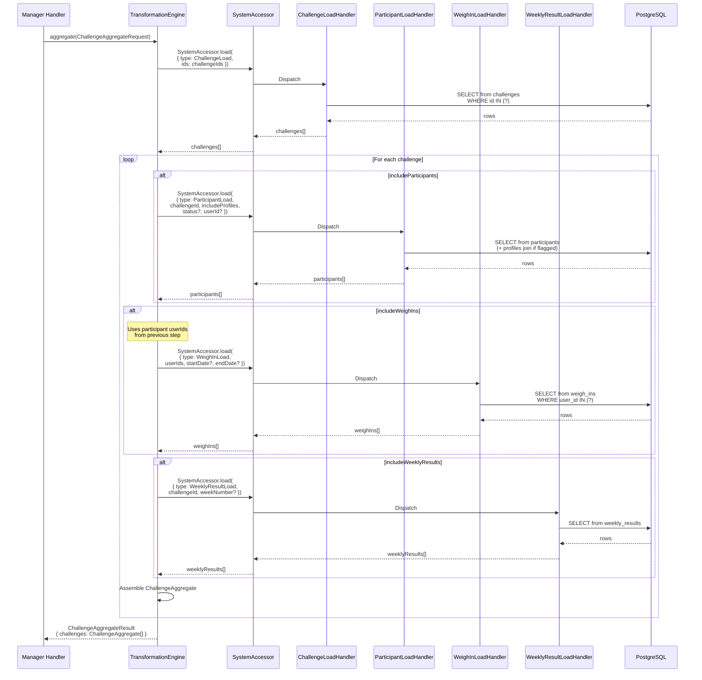

# Aggregation Engine — Detail Design

## Overview

The TransformationEngine's `aggregate()` method assembles a root entity with
its relational data in a single call. Instead of manager handlers making
multiple sequential accessor calls, they request an aggregate with boolean
flags indicating which relations to include.

This keeps manager handler logic clean (focused on business rules) and
isolates repeated data assembly patterns in the engine where they can be
reused across handlers.

---

## ChallengeAggregateRequest

```typescript
interface ChallengeAggregateRequest {
  challengeIds: string[];          // always an array, even for one

  // Relations to include
  includeParticipants?: boolean;
  includeProfiles?: boolean;       // requires includeParticipants
  includeWeighIns?: boolean;       // requires includeParticipants (for userIds)
  includeWeeklyResults?: boolean;

  // Filters for included data
  weighInStartDate?: string;
  weighInEndDate?: string;
  weekNumber?: number;
  participantUserId?: string;      // filter to a single participant
  participantStatus?: string | string[];
}
```

---

## ChallengeAggregateResult

```typescript
interface ChallengeAggregateResult extends ResultBase {
  challenges?: ChallengeAggregate[];  // one entry per challengeId
}

interface ChallengeAggregate {
  challenge: ChallengeRow;
  participants?: ParticipantRow[];    // includes displayName/avatar if includeProfiles
  weighIns?: WeighInRow[];
  weeklyResults?: WeeklyResultRow[];
}
```

---

## Engine Flow



---

## Dependency Order

The engine respects implicit dependencies between flags:

1. **Challenge** — always loaded (it's the root)
2. **Participants** — loaded if `includeParticipants` or needed by weigh-ins
3. **Profiles** — joined into participants if `includeProfiles` (passed as flag to ParticipantLoadHandler)
4. **Weigh-ins** — requires participant userIds, so participants are loaded first even if `includeParticipants` is false
5. **Weekly Results** — independent, filtered by challengeId and optional weekNumber

```
Challenge (always)
  ├── Participants (if includeParticipants OR includeWeighIns)
  │     └── Profiles (if includeProfiles, joined in same query)
  ├── WeighIns (if includeWeighIns, needs participant userIds)
  └── WeeklyResults (if includeWeeklyResults, independent)
```

If `includeWeighIns` is true but `includeParticipants` is false, the engine
still loads participants internally to get userIds, but does not include them
in the result.

Note: `ChallengeLoadCriteria` needs an `ids?: string[]` field added to
support batch loading by the engine.

---

## Usage Examples

### Scoring handler (needs challenge + participants + weigh-ins)

```typescript
const result = await transformationEngine.aggregate({
  challengeIds: [challengeId],
  includeParticipants: true,
  includeWeighIns: true,
  weighInStartDate: lookbackStr,
  weighInEndDate: weekEndStr,
  participantStatus: ['active', 'spinup'],
});
const { challenge, participants, weighIns } = result.challenges![0];
```

### Leaderboard (needs challenge + participants + profiles + all weekly results)

```typescript
const result = await transformationEngine.aggregate({
  challengeIds: [challengeId],
  includeParticipants: true,
  includeProfiles: true,
  includeWeeklyResults: true,
});
const { challenge, participants, weeklyResults } = result.challenges![0];
```

### Single week scorecard (needs challenge + participants + profiles + one week)

```typescript
const result = await transformationEngine.aggregate({
  challengeIds: [challengeId],
  includeParticipants: true,
  includeProfiles: true,
  includeWeeklyResults: true,
  weekNumber: 3,
});
const { challenge, participants, weeklyResults } = result.challenges![0];
```

### Participant detail (one participant + their weigh-ins + their results)

```typescript
const result = await transformationEngine.aggregate({
  challengeIds: [challengeId],
  includeParticipants: true,
  includeProfiles: true,
  includeWeighIns: true,
  includeWeeklyResults: true,
  participantUserId: userId,
});
const { challenge, participants, weighIns, weeklyResults } = result.challenges![0];
```

### Batch (multiple challenges at once)

```typescript
const result = await transformationEngine.aggregate({
  challengeIds: [challenge1Id, challenge2Id, challenge3Id],
  includeParticipants: true,
  includeProfiles: true,
});
// result.challenges — one ChallengeAggregate per ID
for (const agg of result.challenges!) {
  console.log(agg.challenge.name, agg.participants?.length);
}
```

---

## Files to Create/Modify

| File | Action | Purpose |
|------|--------|---------|
| `_shared/engines/transformation/types.ts` | Create | ChallengeAggregateRequest, ChallengeAggregateResult |
| `_shared/engines/transformation/transformation-engine.ts` | Modify | Implement aggregate() method |
| `_shared/engines/transformation/handlers/challenge-aggregate-handler.ts` | Create | Orchestrates accessor calls based on boolean flags |
| `_shared/managers/transaction-manager/handlers/compute-weekly-scores-handler.ts` | Modify | Use aggregate instead of manual accessor calls |

---

## Future Aggregates

The same pattern can be extended for other root entities:

```typescript
// Profile aggregate — user + their challenges + weigh-ins
interface ProfileAggregateRequest {
  userId: string;
  includeActiveChallenge?: boolean;
  includeWeighIns?: boolean;
  weighInLimit?: number;
}

// Public challenge aggregate — challenge + standings (no weights)
interface PublicChallengeAggregateRequest {
  challengeId: string;
  includeParticipants?: boolean;
  includeProfiles?: boolean;
  includeWeeklyResults?: boolean;
  // No includeWeighIns — public view shouldn't expose weights
}
```

Each aggregate type gets its own request/result interface and handler in the
transformation engine.
