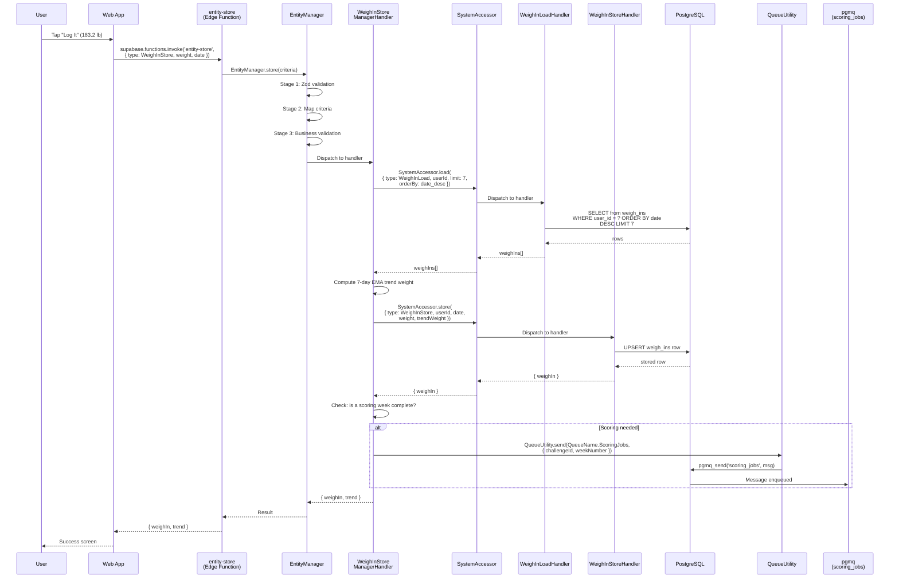
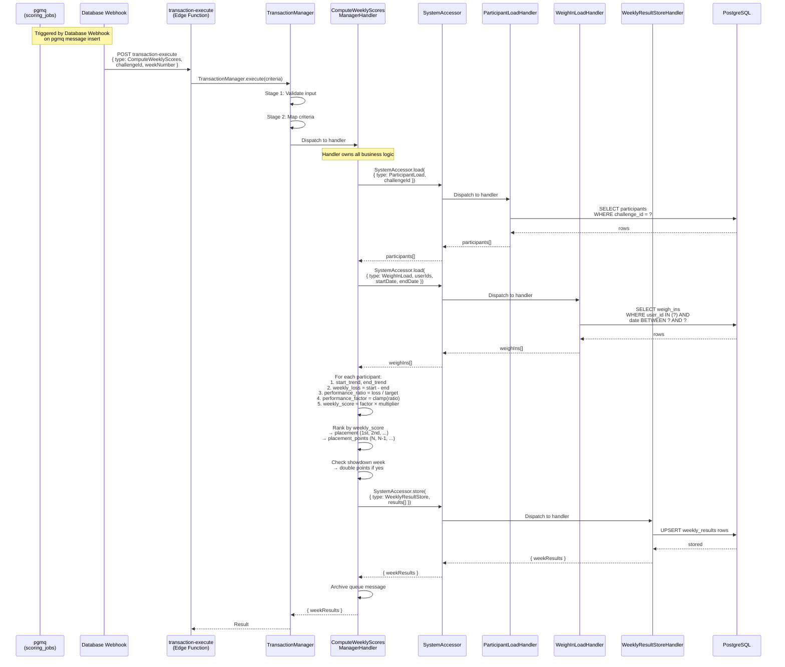
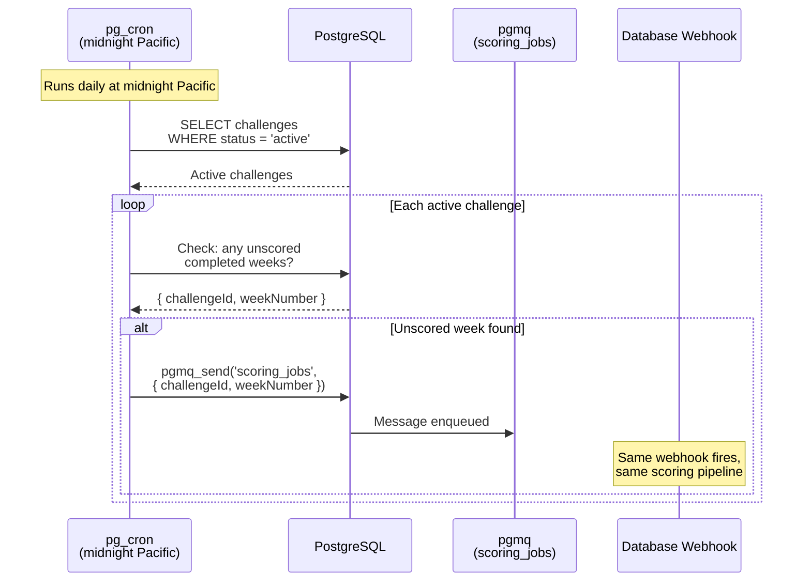
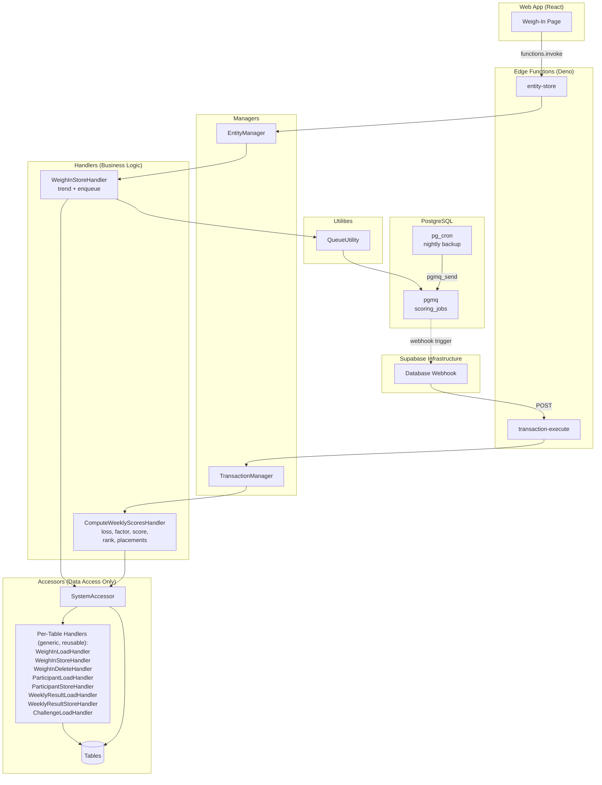

# Weigh-In & Scoring Pipeline — Detail Design

## Overview

When a user logs a daily weight, the system needs to:
1. Validate and store the weigh-in with a server-computed trend weight
2. Check if a scoring week has completed
3. If so, asynchronously compute weekly scores for all participants

This document describes the full call chain from user action to scored results.

---

## Call Chain: Log Weight



---

## Call Chain: Score a Week (Async)



---

## Call Chain: Cron Backup (Daily)



---

## Component Map



---

## Accessor Handler Criteria (Generic, Reusable)

Each accessor handler accepts a criteria object with nullable parameters.
The handler builds a query from whatever is non-null. This means the same
handler serves any manager handler that needs data from that table.

```typescript
// supabase/functions/_shared/accessors/system/types.ts

interface WeighInLoadCriteria {
  type: 'WeighInLoad';
  id?: string;
  userId?: string;
  userIds?: string[];
  startDate?: string;
  endDate?: string;
  limit?: number;
  orderBy?: 'date_asc' | 'date_desc';
}

interface WeighInStoreCriteria {
  type: 'WeighInStore';
  userId: string;
  date: string;
  weight: number;
  trendWeight?: number;
}

interface WeighInDeleteCriteria {
  type: 'WeighInDelete';
  id?: string;
  userId?: string;
  date?: string;
}

interface ParticipantLoadCriteria {
  type: 'ParticipantLoad';
  id?: string;
  challengeId?: string;
  userId?: string;
  status?: string | string[];
  includeProfiles?: boolean;
}

interface ParticipantStoreCriteria {
  type: 'ParticipantStore';
  challengeId: string;
  userId: string;
  status?: string;
  startingWeight?: number;
  targetWeight?: number;
  weeklyTarget?: number;
  goalMethod?: string;
  goalInput?: number;
  totalLoss?: number;
}

interface WeeklyResultLoadCriteria {
  type: 'WeeklyResultLoad';
  challengeId?: string;
  participantId?: string;
  weekNumber?: number;
}

interface WeeklyResultStoreCriteria {
  type: 'WeeklyResultStore';
  results: WeeklyResultRow[];
}

interface ChallengeLoadCriteria {
  type: 'ChallengeLoad';
  id?: string;
  inviteCode?: string;
  status?: string | string[];
  isPublic?: boolean;
  createdBy?: string;
}
```

---

## Queue Name Enum

Queue names are defined as an enum in the shared edge function layer,
accessible by any manager that needs to enqueue work:

```typescript
// supabase/functions/_shared/types/queue-names.ts
export enum QueueName {
  ScoringJobs = 'scoring_jobs',
  // Future queues:
  // NotificationJobs = 'notification_jobs',
  // ChallengeTransitions = 'challenge_transitions',
}
```

Used by managers:
```typescript
import { QueueName } from '../types/queue-names.ts';

await queueUtility.send({
  queue: QueueName.ScoringJobs,
  message: { challengeId, weekNumber },
});
```

---

## Week Boundary Logic

A scoring week is complete when:

```
week_end_date = challenge.start_date + (weekNumber × 7) - 1

Scoring triggers when:
1. Current date > week_end_date (week has ended)
2. No weekly_results row exists for this challenge + week
3. Either:
   a. All participants have at least 1 weigh-in in the week (last person logged)
   b. A new week has started and previous week was never scored
   c. pg_cron nightly check finds an unscored week
```

---

## Database Changes Required

1. **Enable pgmq extension** — `create extension pgmq;`
2. **Create scoring_jobs queue** — `select pgmq.create('scoring_jobs');`
3. **Public wrapper functions** for pgmq (Edge Functions need public schema access)
4. **pg_cron job** — nightly check for unscored weeks
5. **Database Webhook** — configured in Supabase dashboard, fires on pgmq message

---

## Files to Create/Modify

| File | Action | Purpose |
|------|--------|---------|
| `_shared/types/queue-names.ts` | Create | QueueName enum |
| `_shared/utilities/queue/queue-utility.ts` | Create | pgmq wrapper |
| `_shared/accessors/system/system-accessor.ts` | Modify | Add dispatch to new handlers |
| `_shared/accessors/system/handlers/weigh-in-load-handler.ts` | Create | Generic weigh_ins SELECT (nullable: userId, userIds, startDate, endDate, limit, orderBy) |
| `_shared/accessors/system/handlers/weigh-in-store-handler.ts` | Create | Generic weigh_ins UPSERT (userId, date, weight, trendWeight) |
| `_shared/accessors/system/handlers/weigh-in-delete-handler.ts` | Create | Generic weigh_ins DELETE (nullable: id, userId, date) |
| `_shared/accessors/system/handlers/participant-load-handler.ts` | Create | Generic participants SELECT (nullable: id, challengeId, userId, status, includeProfiles) |
| `_shared/accessors/system/handlers/participant-store-handler.ts` | Create | Generic participants UPSERT |
| `_shared/accessors/system/handlers/weekly-result-load-handler.ts` | Create | Generic weekly_results SELECT (nullable: challengeId, participantId, weekNumber) |
| `_shared/accessors/system/handlers/weekly-result-store-handler.ts` | Create | Generic weekly_results UPSERT (accepts array of result rows) |
| `_shared/accessors/system/handlers/challenge-load-handler.ts` | Create | Generic challenges SELECT (nullable: id, inviteCode, status, isPublic) |
| `_shared/managers/entity-manager/handlers/weigh-in-store-handler.ts` | Create | Trend computation + week boundary check + enqueue scoring job |
| `_shared/managers/transaction-manager/handlers/compute-weekly-scores-handler.ts` | Create | All scoring business logic: loss, factor, score, rank, placements, showdown |
| `supabase/migrations/YYYYMMDD_pgmq_scoring_queue.sql` | Create | pgmq extension + queue + public wrappers |
| `apps/web/src/hooks/use-weigh-ins.ts` | Modify | Replace direct DB calls with functions.invoke |
