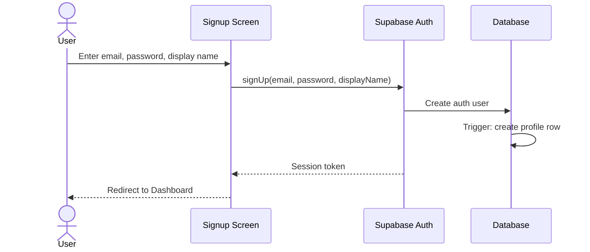

# UC-1 — Sign Up

## Actor
Unauthenticated user

## Description
Create an account to start using the app. After signup, the user can
immediately begin solo weight tracking or join a challenge.

## Journey

## Edge Cases
- Email already registered → show error, suggest login
- Weak password → show validation (min length from Supabase config)
- Display name taken → TBD if we enforce uniqueness

## Test Scenarios
- **Unit:** Validate email format, password strength
- **Integration:** Signup creates auth user + profile row
- **E2E:** Full signup flow → lands on dashboard

## References
- Screen: [SCR-SIGNUP](../screens/SCR-SIGNUP.md)
- Entity: [ENT-USER](../entities/ENT-USER.md)
