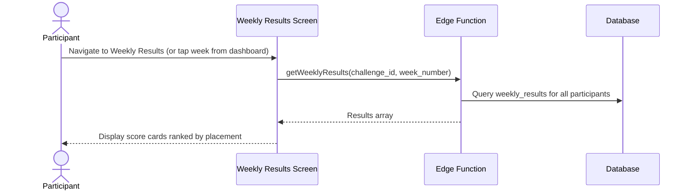

# UC-10 — View Weekly Results

## Actor
Participant in an active or completed challenge

## Description
View the score breakdown for a specific week: all participants' scores,
placements, and points. Navigate between weeks.

## Journey

## Display Elements
- Week header: "Week 3" + date range + Showdown badge if applicable
- For each participant (ranked by placement):
  - Placement badge (1st/2nd/3rd/4th)
  - Display name
  - Weekly loss
  - Performance factor (visual indicator: green/yellow/red)
  - Weekly score
  - Placement points earned
- Week navigation (prev/next)

## References
- Screen: [SCR-WEEKLY](../screens/SCR-WEEKLY.md)
- Components: [CMP-SCORE-CARD](../components/CMP-SCORE-CARD.md), [CMP-PLACEMENT-BADGE](../components/CMP-PLACEMENT-BADGE.md), [CMP-WEEK-SELECTOR](../components/CMP-WEEK-SELECTOR.md), [CMP-SHOWDOWN-BANNER](../components/CMP-SHOWDOWN-BANNER.md)
