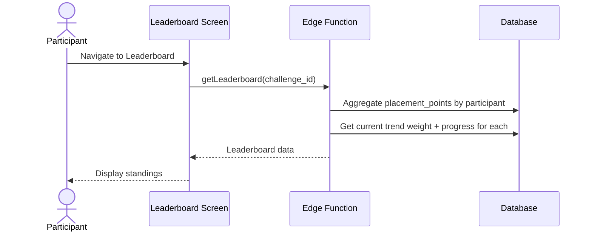

# UC-11 — View Leaderboard

## Actor
Participant in an active or completed challenge

## Description
View the overall challenge standings: total placement points, progress
toward goal, and current trend for each participant.

## Journey

## Display Elements
- For each participant (ranked by total points):
  - Rank
  - Display name + avatar
  - Total placement points
  - Progress bar (% toward goal)
  - Current trend weight (if privacy allows — see GAP-10)
  - Status badge (active / maintenance)
- Challenge info: weeks remaining, next showdown date

## References
- Screen: [SCR-LEADERBOARD](../screens/SCR-LEADERBOARD.md)
- Components: [CMP-STANDING-ROW](../components/CMP-STANDING-ROW.md), [CMP-PROGRESS-BAR](../components/CMP-PROGRESS-BAR.md)
