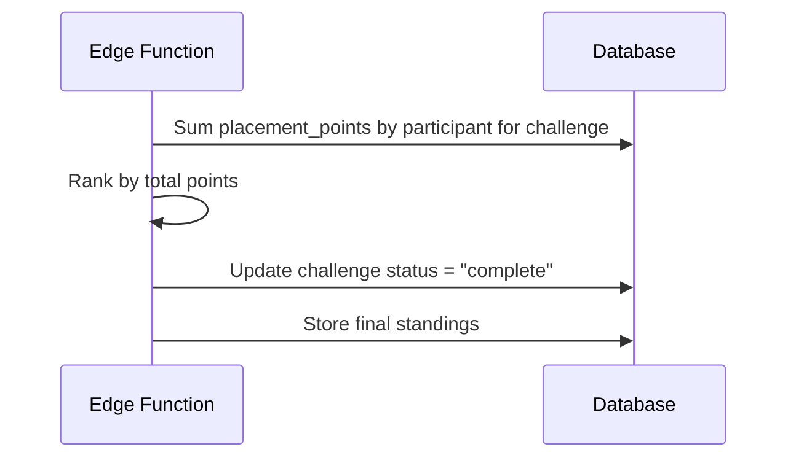

# UC-13 — Determine Winner

## Actor
System (triggered after final week scoring)

## Description
After the last week's scores are computed, determine the challenge winner
by total placement points. Update challenge status to complete.

## Journey

## Tie-Breaking
Ties result in co-winners — both get the higher placement, consistent with
the weekly tie rule. No additional tie-breaking mechanism.

## References
- Entity: [ENT-CHALLENGE](../entities/ENT-CHALLENGE.md) (status → complete)
- Entity: [ENT-WEEKLY-RESULT](../entities/ENT-WEEKLY-RESULT.md)
