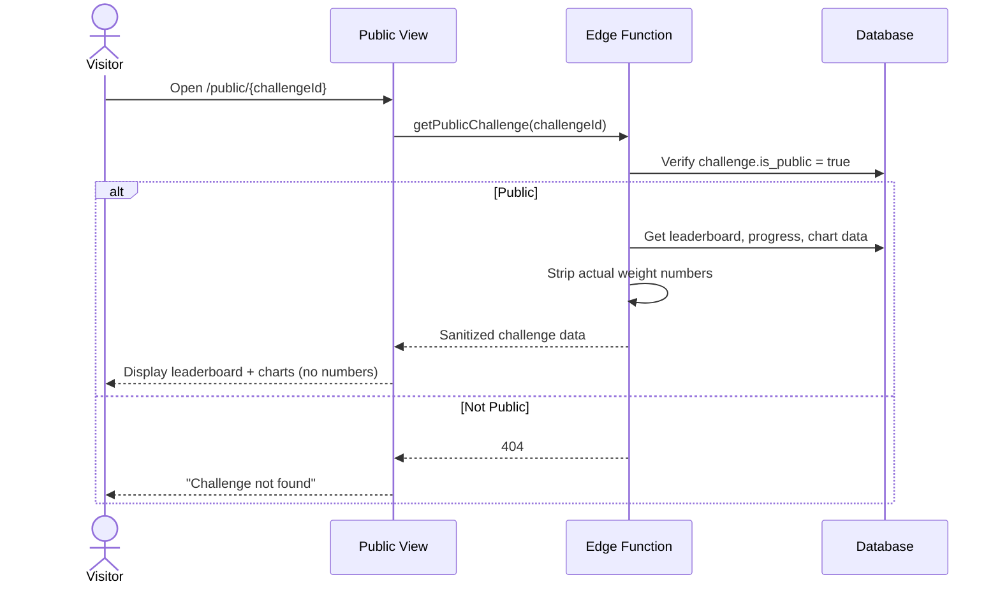

# UC-17 — View Public Challenge

## Actor
Anyone (no auth required)

## Description
View a public challenge's leaderboard and progress without seeing actual
weight numbers. Available when the challenge creator has enabled the public
toggle.

## Journey

## Displayed Data (Sanitized)
- Display names + rankings
- Total placement points
- Progress bars (percentage only)
- Trend chart shapes (relative, no Y-axis values)
- Week-by-week placements
- Showdown indicators
- Winner (if complete)

## Hidden Data
- Actual weights, trend weights
- BMI values
- Goal targets (lb)
- Weigh-in dates/values

## Edge Cases
- Challenge is not public → 404 (don't reveal existence)
- Challenge in setup/spinup → show "Challenge hasn't started yet"
- Challenge complete → show final results + winner

## References
- Screen: [SCR-PUBLIC](../screens/SCR-PUBLIC.md)
- Entity: [ENT-CHALLENGE](../entities/ENT-CHALLENGE.md) (is_public field)
