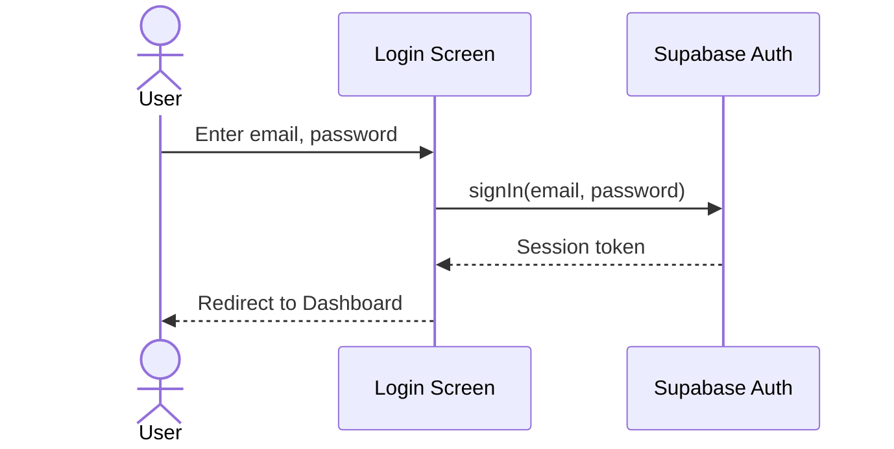

# UC-2 — Log In

## Actor
Unauthenticated user (existing account)

## Description
Authenticate with email and password to access the app.

## Journey

## Edge Cases
- Invalid credentials → show error
- Unconfirmed email → show "check your email" message (if email confirmation enabled)

## Test Scenarios
- **Unit:** Validate email format
- **Integration:** Login returns valid session
- **E2E:** Login flow → lands on dashboard with user data

## References
- Screen: [SCR-LOGIN](../screens/SCR-LOGIN.md)
