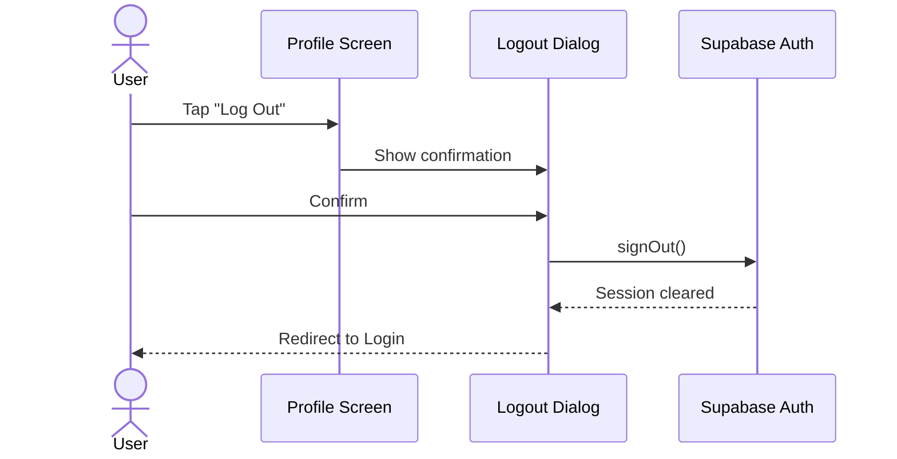

# UC-3 — Log Out

## Actor
Authenticated user

## Description
Sign out of the app. Clears session and returns to login screen.

## Journey

## References
- Screen: [SCR-PROFILE](../screens/SCR-PROFILE.md)
- Dialog: [DLG-LOGOUT](../screens/DLG-LOGOUT.md)
