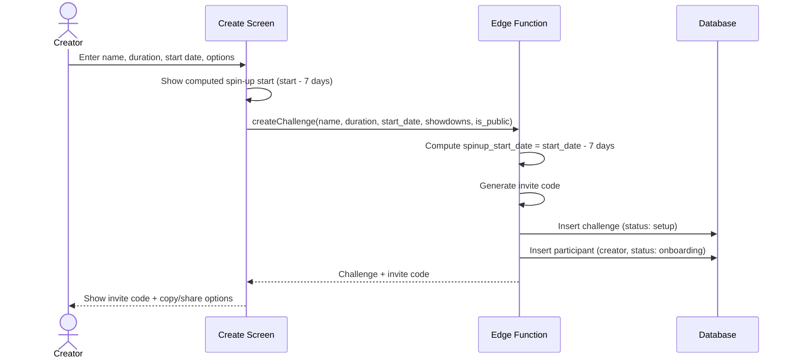

# UC-4 — Create Challenge

## Actor
Authenticated user (becomes challenge creator)

## Description
Create a new weight loss challenge and get an invite code to share with
other participants. The creator is automatically added as a participant.

## Journey

## Decision Questions

**Q1: What durations are allowed?**
Resolved: 10, 12, 14, or 16 weeks. Selectable by creator.

**Q2: When is the start date set?**
Resolved: At creation time. The spin-up week (7 days before) is communicated
clearly in the form: "Spin-up begins [date], scoring begins [start date]."

**Q3: Max participants?**
Default 4 per the ruleset. Stored on the challenge for flexibility.

**Q4: Showdown weeks?**
Optional toggle at creation (default: enabled). When enabled, last Friday of
each month + final week get doubled points.

**Q5: Public visibility?**
Optional toggle at creation (default: off). When enabled, a public URL shows
leaderboard and chart shapes without weight numbers.

## Edge Cases
- User already in an active challenge → allow or block? (TBD)
- Invite code collision → regenerate (extremely unlikely with sufficient length)

## Test Scenarios
- **Unit:** Invite code generation format and uniqueness
- **Integration:** Challenge + participant created in single transaction
- **E2E:** Create → see invite code → can copy/share

## References
- Screen: [SCR-CREATE](../screens/SCR-CREATE.md)
- Entity: [ENT-CHALLENGE](../entities/ENT-CHALLENGE.md), [ENT-PARTICIPANT](../entities/ENT-PARTICIPANT.md)
