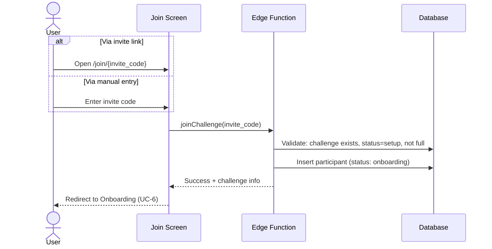

# UC-5 — Join Challenge

## Actor
Authenticated user

## Description
Join an existing challenge using an invite code or invite link. After joining,
the user proceeds to onboarding (UC-6) to set their goal.

## Journey

## Edge Cases
- Invalid code → "Challenge not found"
- Challenge already full → "This challenge is full"
- Challenge not in setup status → "This challenge has already started"
- User already in this challenge → "You're already in this challenge"
- User already in another active challenge → TBD (see GAP in CONFLICTS_AND_GAPS)

## Test Scenarios
- **Unit:** Invite code validation format
- **Integration:** Join creates participant, respects max_participants
- **E2E:** Enter code → join → land on onboarding

## References
- Screen: [SCR-JOIN](../screens/SCR-JOIN.md)
- Entity: [ENT-CHALLENGE](../entities/ENT-CHALLENGE.md), [ENT-PARTICIPANT](../entities/ENT-PARTICIPANT.md)
