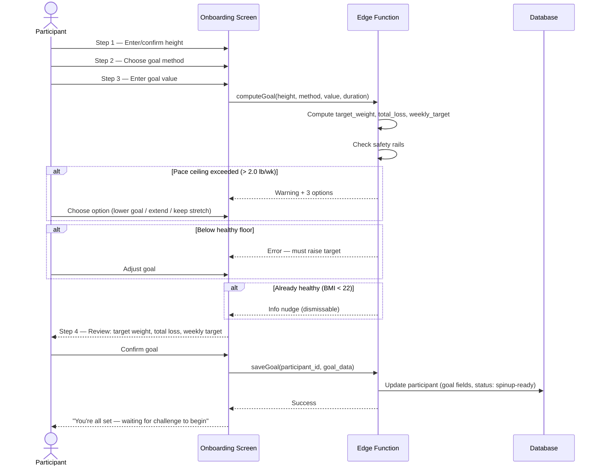

# UC-6 — Complete Onboarding

## Actor
Participant (status: onboarding)

## Description
Set height (if not already set), review starting info, and choose a weight
loss goal using one of five methods. Safety rails are applied. On completion,
participant status moves to ready for spin-up.

## Journey

## Goal-Setting Methods (Reference)

| Method            | Input              | Computation                          |
|-------------------|--------------------|--------------------------------------|
| target_weight     | target weight (lb) | total_loss = starting - target       |
| percent_loss      | percentage         | total_loss = % × starting            |
| target_bmi        | target BMI         | target_wt from BMI formula           |
| weekly_pace       | lb/wk              | total_loss = pace × weeks            |
| suggested_default | (none)             | pace = 1.5 lb/wk                     |

## Safety Rails

1. **Pace ceiling:** weekly_target > 2.0 lb/wk
   - Lower goal to fit 2.0 lb/wk pace
   - Extend challenge to fit goal at safe pace
   - Keep as stretch goal (warned about scoring penalty)

2. **Healthy floor:** target < BMI 18.5 weight + 2 lb buffer → blocked

3. **Already-healthy nudge:** current BMI < 22 → informational, dismissable

## Edge Cases
- User already has height from prior challenge or profile setup → pre-filled
- Suggested default method needs no input → auto-compute and show review
- Pace ceiling: "extend challenge" option only works if creator hasn't locked duration

## Test Scenarios
- **Unit:** All 5 goal methods produce correct (target, loss, pace) triplet
- **Unit:** Safety rail triggers at correct thresholds
- **Unit:** BMI computation from height + weight
- **Integration:** Goal saved, participant status updated
- **E2E:** Full onboarding flow for each goal method
- **E2E:** Each safety rail fires and displays correctly

## References
- Screen: [SCR-ONBOARDING](../screens/SCR-ONBOARDING.md)
- Dialogs: [DLG-SAFETY-RAIL](../screens/DLG-SAFETY-RAIL.md), [DLG-CONFIRM-GOAL](../screens/DLG-CONFIRM-GOAL.md)
- Entity: [ENT-PARTICIPANT](../entities/ENT-PARTICIPANT.md)
