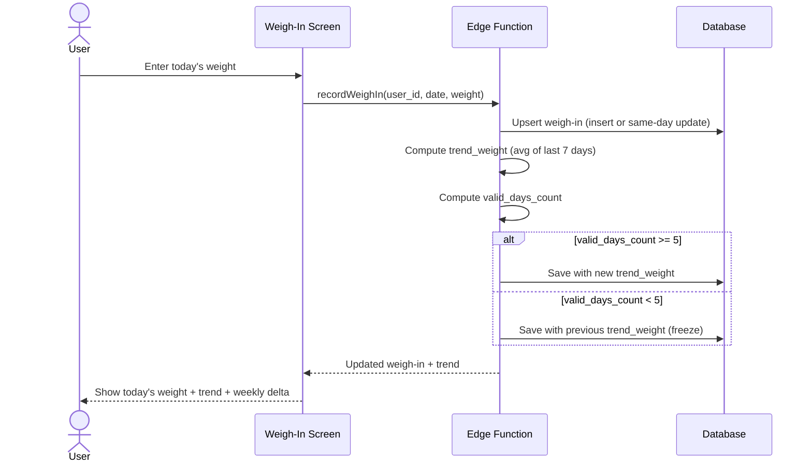

# UC-7 — Record Weigh-In

## Actor
Authenticated user (solo or in a challenge)

## Description
Record a daily weight measurement. The system computes the 7-day rolling
trend weight. This is the core daily interaction with the app.

## Journey

## Trend Weight Rules
- **Rolling average:** Mean of last 7 calendar days with readings
- **Minimum threshold:** At least 5 of 7 days must have a reading
- **Freeze behavior:** If below threshold, trend holds at last valid value
- **Building up:** During first 7 days, trend starts computing as soon as
  enough days exist (minimum 5)

## Edge Cases
- Already weighed in for this date → update existing entry
- Editing a past day → allowed (honor system), trend recomputed for affected dates
- First-ever weigh-in → trend = today's weight (1 day = 1 reading)
- During spin-up → weigh-in counts toward 7-day starting average

## Test Scenarios
- **Unit:** Trend computation with all 7 days present
- **Unit:** Trend computation with exactly 5 of 7 days
- **Unit:** Trend freeze when below 5 of 7
- **Unit:** Trend recovery when days catch back up
- **Integration:** Weigh-in insert computes and stores correct trend
- **Integration:** Same-day edit updates weight and recomputes trend
- **E2E:** Enter weight → see trend update → see on dashboard

## References
- Screen: [SCR-WEIGH-IN](../screens/SCR-WEIGH-IN.md)
- Entity: [ENT-WEIGH-IN](../entities/ENT-WEIGH-IN.md)
