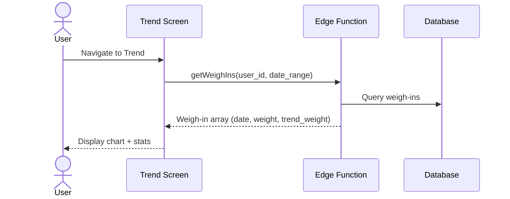

# UC-8 — View Weight Trend

## Actor
Authenticated user (solo or in a challenge)

## Description
View personal weight trend over time as a chart. Shows daily weights, trend
line, and optionally the target weight as a reference line.

## Journey

## Display Elements
- **Line chart:** Daily weights (dots) + trend line (smooth)
- **Reference line:** Target weight (from challenge goal or personal target)
- **Stats below chart:**
  - Current trend weight
  - Weekly change (this week's trend vs last week's)
  - Total change from starting weight
  - Days tracked

## Edge Cases
- No weigh-ins yet → empty state with prompt to weigh in
- Gaps in data → chart connects across gaps, trend line shows freeze periods
- Solo user with no target → no reference line shown

## References
- Screen: [SCR-TREND](../screens/SCR-TREND.md)
- Component: [CMP-TREND-CHART](../components/CMP-TREND-CHART.md)
- Entity: [ENT-WEIGH-IN](../entities/ENT-WEIGH-IN.md)
