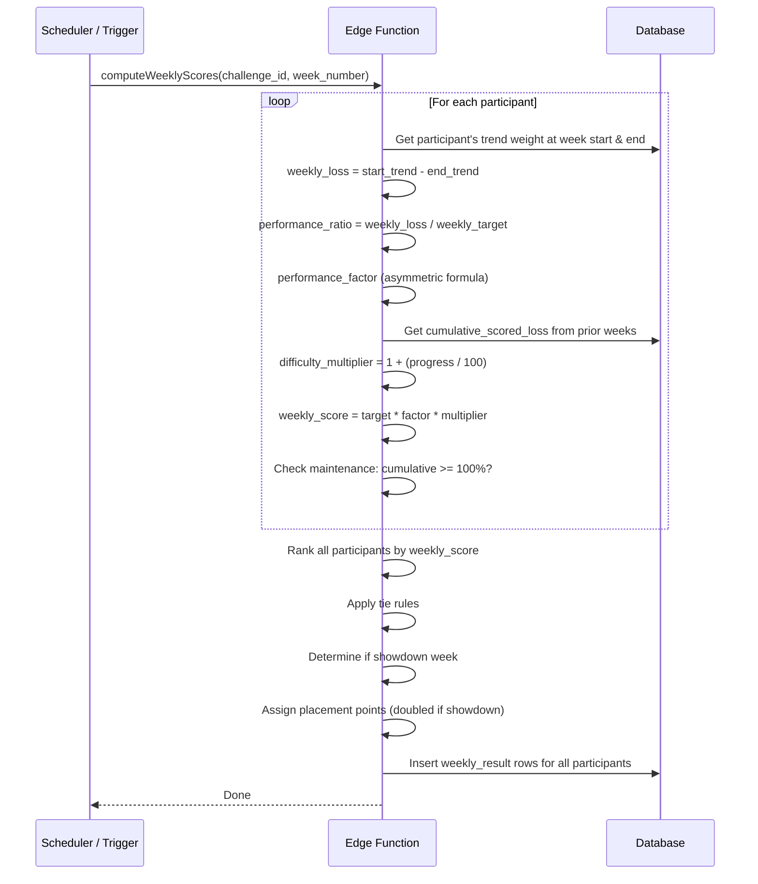

# UC-9 — Compute Weekly Scores

## Actor
System (edge function, triggered or scheduled)

## Description
At the end of each challenge week (Friday), compute scores for all
participants: weekly loss, performance factor, difficulty multiplier,
weekly score, placements, and placement points.

## Journey



## Scoring Details

### Performance Factor
```
ratio <= 1.0: factor = ratio
ratio >  1.0: factor = max(0, 1 - 2 * (ratio - 1))
```

### Difficulty Multiplier
```
cumulative_scored_loss = sum(weekly_target * performance_factor) for prior weeks
progress = cumulative_scored_loss / total_loss * 100
multiplier = min(2.0, 1 + progress / 100)
```

### Tie Rules
Ties take the higher placement; next solo drops by tie count.
- 2-way 1st: 4, 4, 2, 1
- 3-way 1st: 4, 4, 4, 1
- Tie 2nd: 4, 3, 3, 1
- Tie 3rd: 4, 3, 2, 2
- All tied: 4, 4, 4, 4

### Showdown Detection
Only applies when `challenge.showdowns_enabled = true`:
- Last Friday of the calendar month = showdown
- Final week of the challenge is always a showdown (regardless of calendar)
- Points doubled during showdown weeks
When showdowns are disabled, all weeks use standard 4/3/2/1.

### Maintenance
If cumulative_progress >= 100%, participant enters maintenance. They earn
1 pt (or 2 in showdown) if trend is within ±2 lb of target weight, else 0.

## Edge Cases
- Participant has no weigh-ins for the week → trend frozen, weekly_loss = 0
- Weight gain → negative weekly_loss, ratio < 0, factor = negative → clamped to 0
- All participants gain weight → all get factor 0, all tied → 4, 4, 4, 4
- Final week: see GAP-3 for showdown decision

## Test Scenarios
- **Unit:** Performance factor at every reference point (0, 0.5, 0.9, 1.0, 1.1, 1.25, 1.5)
- **Unit:** Difficulty multiplier progression over multiple weeks
- **Unit:** All tie rule scenarios
- **Unit:** Showdown detection across month boundaries
- **Unit:** Maintenance mode entry and point assignment
- **Integration:** Full scoring pipeline for 4 participants
- **Integration:** Consecutive weeks with cumulative state

## References
- Entity: [ENT-WEEKLY-RESULT](../entities/ENT-WEEKLY-RESULT.md)
